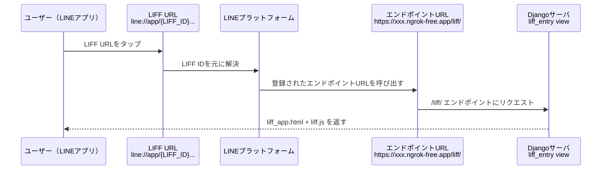

## 1. LINEアプリ開発の基礎と実装例

### 1-1. 基礎概念

#### 1-1-a. **LINEプラットフォーム**

ユーザーのLINEアプリやボットアプリを支えている **LINEの公式バックエンドシステム**。

行うこと：

* **ログイン認証**
  * ユーザーがLIFFでログインすると、LINEプラットフォームがIDトークンを発行する。
  * そのトークンをサーバ（Django）が受け取り、再びLINEプラットフォームに投げて検証する。
* **Messaging API**
  * ボットの送受信（push/replyメッセージ）もLINEプラットフォーム経由で行われる。
  * だから、Djangoサーバ → LINEプラットフォーム → ユーザーのLINEアプリ という流れになる。
* **LIFF解決**
  * ユーザーが `line://app/{LIFF_ID}` をタップすると、LINEアプリはこのLIFF IDをLINEプラットフォームに問い合わせ、登録されている **エンドポイントURL** を取り出してアクセスする。

【図解】

```
ユーザーのLINEアプリ
       │
       ▼
  LINEプラットフォーム（認証・URL解決・メッセージ配信）
       │
       ▼
  Djangoサーバ（/liff/ や /api/... を処理）
```


#### 1-1-b. LIFF（Line Front-end Framework）

LINE が提供している **Webアプリの実行環境** 。

通常のWebアプリをスマホのブラウザやPCで開くのではなく、**LINEアプリの中のWebView（内蔵ブラウザ）** として起動できる仕組みを提供している。

##### 特徴

1. **LINEアプリ内で動くWebアプリ**
   * `line://app/{LIFF_ID}` というスキームで呼び出せる。
   * ユーザーはリンクをタップすると、LINEアプリの画面上でWebアプリが開く。
2. **LINEユーザーの情報にアクセスできる**
   * `liff.getProfile()` でユーザーの名前やアイコンを取得可能。
   * `liff.getIDToken()` で **IDトークン** を受け取り、サーバ側で本人確認ができる。
3. **スコープ（scope）**
   * OpenID Connect の用語で、**どの情報をトークンに含めるかを指定する権限範囲** のこと。
   * 例: `profile`, `openid`, `email` など。
   * グループIDやユーザーIDのような「対象範囲」を表す言葉ではない。
4. **トークン（token）**
   * LIFFで扱うのは主に  **IDトークン** 。
   * これはログイン済みユーザーを識別するためのJWT形式の文字列で、`sub`（ユーザーID）や `exp`（有効期限）などが入っている。
   * サーバ側では `/oauth2/v2.1/verify` API を使って検証し、正当なユーザーか確認する。

##### LIFF URL と エンドポイントURL

LIFF URL（ディープリンク）　※本アプリでは未使用

- **形式**: `line://app/{LIFF_ID}?src=group&groupId=xxxx`
- **利用場面**: LINEアプリのトーク画面やFlexメッセージのリンク
- **役割**: LINEアプリからLIFFアプリを開くための「入口」。LINE外（メール、QRコード、外部Webサイトなど）から「LINEアプリを強制的に開きたい」ときに使える
- **特徴**: LINEアプリ専用のスキームであり、ブラウザから直接開いても動かない

エンドポイントURL（LIFF Endpoint URL）

- **形式**: `https://example.com/liff/` （開発中は `http://localhost:8000/liff/`）
- **利用場面**: LINE Developers コンソールでLIFFに設定
- **役割**: 実際にWebアプリ（Django）が配信されるURL
- **特徴**: Djangoの `liff_entry` view がここを処理し、`liff_app.html` を返す

【図解】

```
ユーザー（LINEアプリ内でタップ）
       │
       ▼
   LIFF URL (line://app/xxxx...)
       │
       ▼
  LINEプラットフォームが対応する
  エンドポイントURLを解決
       │
       ▼
 エンドポイントURL (https://.../liff/)
 → Djangoが liff_app.html を返してJS動作
```




---

### 1-2. 実装例

#### 1-2-a. LIFF IDと初期化

`liff.js` 内で `liff.init` を呼び出し、LIFF IDを指定して初期化している。

もしログインしていなければ、`liff.login()` が実行される。

```js
async function initLiffAndLogin(liffId) {
  await liff.init({ liffId, withLoginOnExternalBrowser: true });
  if (!liff.isLoggedIn()) {
    liff.login({ redirectUri });
    return false;
  }

  gIdToken = liff.getIDToken() || "";
  if (!gIdToken) throw new Error("no id_token");

  // ユーザーIDを保存
  const dec = liff.getDecodedIDToken && liff.getDecodedIDToken();
  currentUserId = (dec && dec.sub) || "";
  return true;
}
```

**ポイント解説:**

* `withLoginOnExternalBrowser: true` を設定することで、PCブラウザからの動作確認にも対応できる。
* `liff.getIDToken()` はユーザー認証の結果得られるJWT。サーバサイドで検証してユーザーを特定する。
* IDトークンは有効期限があるため、`isTokenStale()` のような仕組みで期限切れを検出し、再ログインを促す実装が必要。

---

#### 1-2-b. IDトークンのサーバ検証

サーバ側（Django）では `views.verify_idtoken` にて、LINE公式の検証APIを呼んでいる。

```python
@csrf_exempt
def verify_idtoken(request):
    body = json.loads(request.body.decode('utf-8'))
    id_token = body.get('id_token')
    res = requests.post(
        'https://api.line.me/oauth2/v2.1/verify',
        data={'id_token': id_token, 'client_id': getattr(settings, 'MINIAPP_CHANNEL_ID', '')},
        timeout=10
    )
    data = res.json()
    if res.status_code != 200:
        return JsonResponse({'ok': False, 'reason': data}, status=400)
    return JsonResponse({'ok': True, 'payload': data})
```

**ポイント解説:**

* `client_id` には「LINEミニアプリチャネル」のIDを使う必要がある。Messaging APIのチャネルIDとは別物。
* 成功すると `sub`（ユーザーID）, `name`, `picture` が返ってくる。
* この仕組みによって「LINEユーザー本人しかイベントを操作できない」ことを担保できる。

---

#### 1-2-c. LIFF URL作成

例えば、以下のようなアクションがあると `utils.py` にある `build_liff_url_for_source` が発動し、「グループのイベント一覧」へのリンクが生成される。

- グループチャットで「イベントリンク」と送信する
- 「共有するグループへの通知オン」で新規にイベントが作成される

```python
def build_liff_url_for_source(source_type: str, group_id: str | None = None, user_id: str | None = None) -> str:
    if source_type == "group" and group_id:
        params = {"src": "group", "groupId": group_id}
    elif source_type == "user" and user_id:
        params = {"src": "user", "userId": user_id}
    else:
        params = {"src": "unknown"}
    return f"{base.rstrip('/')}?{urlencode(params)}"
```

**ポイント解説:**

* グループ起点なら `?src=group&groupId=...`、1:1起点なら `?src=user&userId=...` が付与される。
* このscope_idが「どのグループのイベントか」を識別するキーになっている。

---
